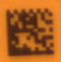

# Code Reader Example

This example demonstrates how to read a datamatrix code from an image.
Currently, the code reader only supports data matrix codes.
The program outputs the data, that was read from the code on the console.
The code reader is also capable of reading multiple codes in an image and the program will output the found data
separated by newlines.

## Input Image

## Output

`4108618458`

## Requirements

This example depends on the following components:

- [IDS peak standard Setup](https://en.ids-imaging.com/download-peak.html) version 2.20 or later
- **CMake** version 3.10 or later
- A supported C++ compiler (MSVC, GCC, or Clang)
