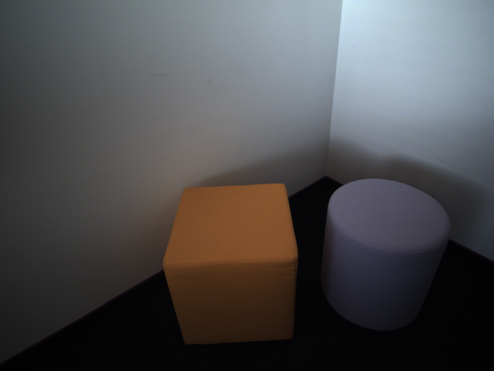
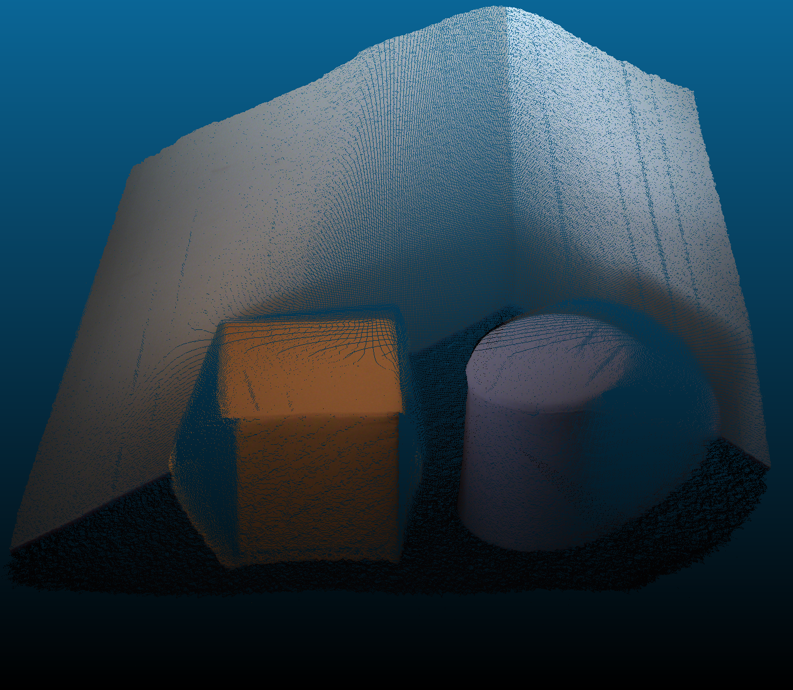

# Textured Point Cloud Example

This example demonstrates how to align 3D coordinate data from a 3D camera with a 2D color image from a standard 2D RGB
camera. By utilizing intrinsic and extrinsic calibration parameters, the 3D coordinate data is undistorted and projected
into the 2D camera's coordinate system.

After projection, the point cloud and the color image share the same coordinate space, meaning a pixel at index `[x, y]`
corresponds to the exact same physical point in both images. The result is a colorized (textured) point cloud which is
saved as a `.ply` file next to the executable.

Observed scene:

Resulting textured point cloud:

For a complete step-by-step tutorial on multi-camera setup and calibration, please refer to our website guide:
[Guide: Textured Point Cloud](INSERT_YOUR_WEBSITE_LINK_HERE)

## Requirements

- [IDS peak Setup](https://en.ids-imaging.com/download-peak.html) version 26.06.2 or later
- **CMake** version 3.10 or later
- A supported C++ compiler (MSVC, GCC, or Clang)

## Adapting to Physical Cameras

This example uses pre-calibrated images loaded directly from files. To implement this workflow with your physical
cameras, you will need to capture live data and calculate your own calibration parameters.

You can learn how to do this by exploring the following related examples:

[Image Acquisition](../get_first_pixel): Learn how to capture 2D images.

[Nion Point Cloud](../nion_point_cloud): Learn how to capture 3D coordinate data with a 3D camera.

[Calibration From File](../calibration_from_file): Learn how to perform a standard camera calibration to obtain the
intrinsic parameters for both cameras.

[Undistortion From File](../undistortion_from_file): Learn how to undistort an image.

[Workspace Calibration From File](../workspace_calibration_from_file): Learn how to calculate the extrinsic parameters
by capturing a calibration plate in the exact same location in both cameras.

Once you have mastered these individual concepts, you can combine them to dynamically generate textured point clouds
using live physical cameras.

