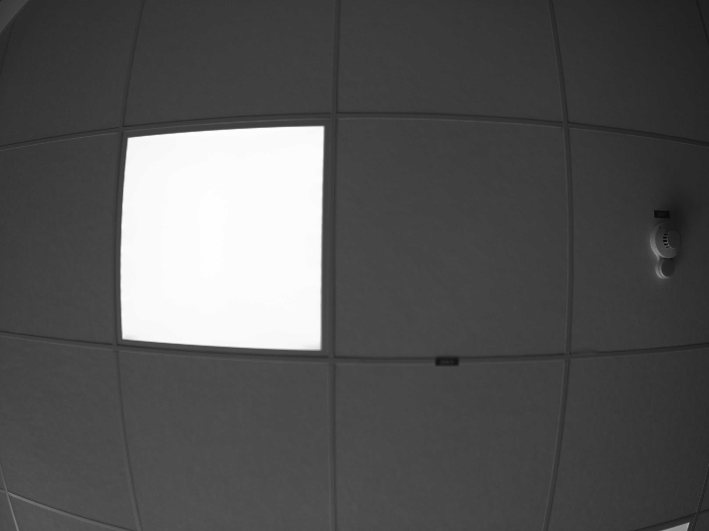

# Workspace Calibration Example

This example demonstrates how to undistort a distorted image using precomputed camera calibration parameters.

The calibration data from example ) is used to correct lens
distortions in the input image, resulting in a geometrically accurate, undistorted output. This showcases how previously
obtained calibration results can be reused to improve image quality and measurement accuracy.

The resulting image is saved next to the executable.

## Input Image

Distorted Image

## Undistorted Image

The following image is scaled for visuals.

## Requirements

This example depends on the following components:

- [IDS peak standard Setup](https://en.ids-imaging.com/download-peak.html) version 2.19 or later
- **CMake** version 3.10 or later
- A supported C++ compiler (MSVC, GCC, or Clang)
