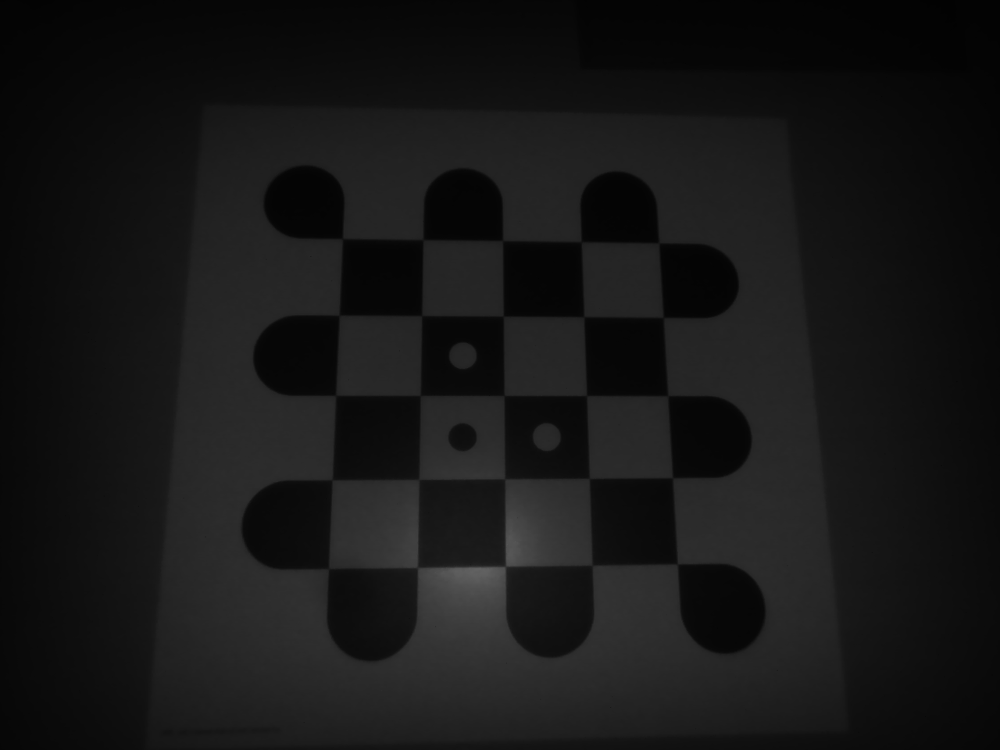

# Workspace Calibration Example

This example demonstrates how to perform a workspace calibration using a calibration plate to define a new coordinate
system.

An image of the calibration plate is captured and used to estimate the transformation that establishes the
workspace coordinate frame. To illustrate the result, a point cloud (based on the
example ) is loaded, and the computed calibration is applied to
transform the data into the new coordinate system. The transformed point cloud is saved for further processing or
visualization. The resulting files are saved next to the executable.

## Input Image

Workspace Image

## Requirements

This example depends on the following components:

- [IDS peak standard Setup](https://en.ids-imaging.com/download-peak.html) version 2.19 or later
- **CMake** version 3.10 or later
- A supported C++ compiler (MSVC, GCC, or Clang)
