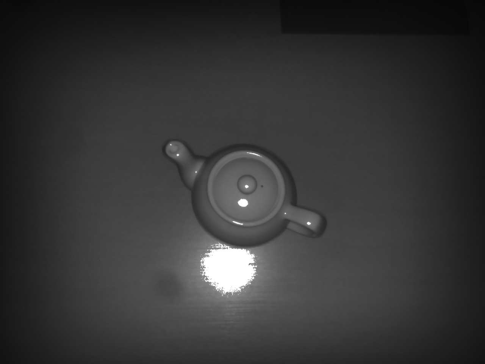

Point Cloud Example

This example demonstrates how to generate a 3D point cloud from raw sensor data, consisting of a depth image, an
intensity image and camera calibration parameters.

First, the input images are undistorted using the provided calibration data to correct lens distortions. The corrected
depth image combined with the intensity information is then used to create a point cloud.
Finally, the resulting point cloud is exported and saved as a .ply file for further use or visualization.

## Input Files

Depth Map:


Intensity Image:



## Output

PLY:


## Requirements

This example requires:

* **C# 8.0 or later**
* **.NET Framework 4.8** (for classic projects)
* **.NET 8** (for modern SDK-style projects)

## Build Instructions

### .NET (modern, SDK-style)

```bash
dotnet build PointCloudFromFile.csproj
dotnet run   --project PointCloudFromFile.csproj
```

> Optional (smaller output):
>
> ```bash
> dotnet build -r win-x64 PointCloudFromFile.csproj
> dotnet run   -r win-x64 --project PointCloudFromFile.csproj
> ```

### .NET Framework (classic)

Use Visual Studio **or**:

```bash
msbuild PointCloudFromFile.csproj /t:Restore
msbuild PointCloudFromFile.csproj /p:Platform=x64
```
