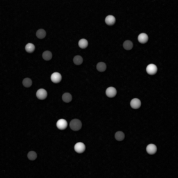

# Image Region Example

This example demonstrates how to handle image regions with the `IDS peak ICV` library.
Regions can be interpreted as a set of points
and can fill a rectangular area of the image, but they don't necessarily have to.
As they are a set of points, their shape can be anything from a single point, over a pixelized circle, to a rectangle.
They are used to enhance image processing performance, while keeping the original image.
Several algorithms in the `IDS peak ICV` library check for an available region in the image and use it when processing.

To illustrate, how regions affect the output of algorithms, the image with its region is processed by a threshold.

## Input Image



## Output

The region is displayed in green.
The result of the threshold is displayed in red.

**Image with full region:**


**Image with reduced region:**


One can observe, that the threshold only processed the green `region` area.
Only the bubbles inside the region are colored red.

## Requirements

The following IDS peak python packages are required:

* `ids-peak-icv`
* `ids-peak-common`

To install all required dependencies, use the provided `requirements.txt`:

```bash
pip install -r requirements.txt
```

## Running the example

After installing all requirements the demo can be run by executing `main.py`
with the Python interpreter:

```bash
python main.py
```
